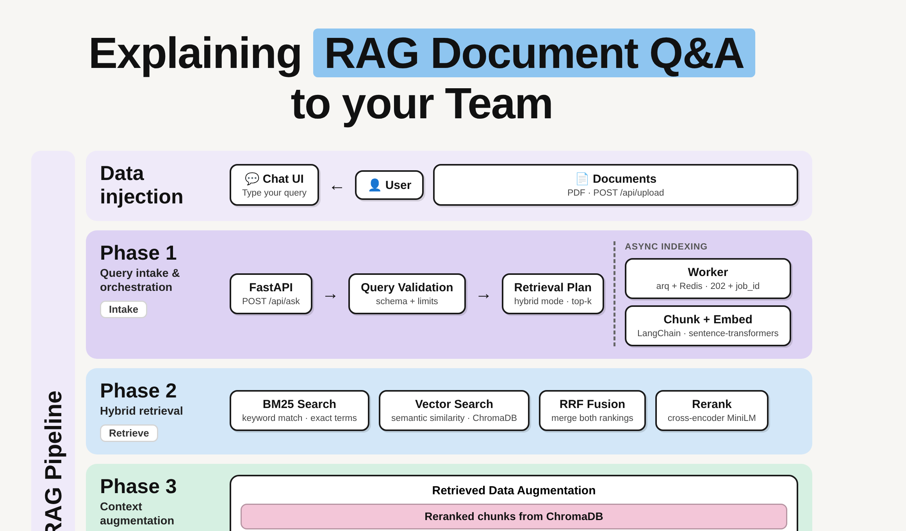

# RAG Document Q&A API

A production-ready Retrieval-Augmented Generation system for querying PDF documents using natural language.


## What it does

1. Upload PDF documents via web UI or API
2. Documents are chunked and embedded using sentence-transformers (local, free)
3. Embeddings stored in ChromaDB (local vector database)
4. Ask questions in natural language → **hybrid retrieval** (BM25 + vector + cross-encoder reranking) → LLM generates answer with source citations
5. Every query is **traced with Langfuse** (retrieval spans, generation spans, token usage, latency)
6. Pipeline quality is **measured with RAGAS** (faithfulness, context precision/recall, answer relevancy)

## Architecture



The query flow in four phases — **intake → hybrid retrieval → augmentation → generation** — plus the async indexing side-lane and the quality loop:

- **Retrieval**: hybrid search (BM25 + vector, fused with RRF) followed by cross-encoder reranking
- **Generation**: reranked chunks are assembled into the prompt and answered by the configured LLM, with citations
- **Indexing**: uploads return `202 + job_id`; a background worker (arq + Redis) chunks, embeds and persists to ChromaDB
- **Observability**: every request is traced in Langfuse (spans, tokens, latency, user feedback); RAGAS evaluates against a versioned golden dataset

An interactive, explorable version (dark/light themes, guided views, trace animation) lives in [`docs/rag-architecture.html`](docs/rag-architecture.html) — open it locally in a browser. The infographic source is [`docs/rag-infographic.html`](docs/rag-infographic.html).

## Stack

- **FastAPI** — REST API + web UI
- **LangChain** — RAG orchestration, document chunking
- **ChromaDB** — vector database (local, persistent)
- **sentence-transformers** — local embeddings + cross-encoder reranker (no API key needed)
- **rank-bm25** — keyword search for hybrid retrieval
- **OpenRouter / OpenAI** — LLM for answer generation (configurable)
- **Langfuse** — observability and tracing (optional, self-hosted)
- **RAGAS** — evaluation metrics (dev dependency)

## Key features

### Hybrid search + reranking
Pure vector search misses exact terms (proper nouns, error codes, numbers). The hybrid retriever combines:
- **BM25** keyword search (in-memory, synced with ChromaDB)
- **Vector search** (ChromaDB cosine similarity)
- **Reciprocal Rank Fusion (RRF)** to merge rankings without comparable score scales
- **Cross-encoder reranking** (`cross-encoder/ms-marco-MiniLM-L-6-v2`) for final precision

Toggle with `HYBRID_SEARCH=true` and `RERANKER_ENABLED=true`.

### Observability (Langfuse)
Every `/api/ask` call produces a trace with:
- A **retrieval span** (query, chunks, scores, latency, mode)
- A **generation span** (model, prompt, answer, token usage, latency)

No-op when Langfuse keys are not set — the app runs identically without an observability backend.

### Async ingestion (arq + Redis)
With `REDIS_URL` set, `POST /api/upload` returns `202 + job_id` instantly and a background worker (`python -m arq worker.WorkerSettings`) chunks, embeds and registers the PDF — with automatic retries (`max_tries=3`), bounded concurrency (`max_jobs=4`) and backpressure from the Redis queue. Poll `GET /api/jobs/{job_id}` for status. Without `REDIS_URL` the app processes uploads synchronously, exactly as before: zero extra infrastructure needed to run locally.

### Feedback loop
Every `/api/ask` response includes a `trace_id`. Rate any answer with `POST /api/feedback` (score `+1`/`-1`, optional comment): feedback is stored locally (`data/feedback.jsonl`) as a tuning dataset and mirrored to Langfuse as a trace score. `GET /api/feedback/summary` returns totals and thumbs-down rate — the metric to watch after every retrieval/prompt change.

### Evaluation (RAGAS)
Answer the interview question *"how do you know your RAG works well?"* with numbers:

```bash
pip install -r requirements-dev.txt
# Upload documents, then:
python -m eval.run_eval --dataset eval/golden_dataset.json --k 5
```

Metrics: **faithfulness** (anti-hallucination), **answer relevancy**, **context precision**, **context recall**.

The golden dataset (`eval/golden_dataset.json`) is versioned JSON — run before/after any retrieval change and compare.

### CI/CD
GitHub Actions runs `ruff check` + `pytest` on every push and PR (`.github/workflows/ci.yml`).

## Roadmap

The system is being scaled in phases, each designed to be demoable and measurable on its own.

### ✅ Phase 0 — Production retrieval core (done)
- Hybrid search (BM25 + vector + RRF fusion) with cross-encoder reranking
- Langfuse tracing on every request (retrieval + generation spans)
- RAGAS evaluation harness with versioned golden dataset
- CI: lint + tests on every push

### 🚧 Phase 1 — Scale & reliability (in progress)
- **Async ingestion**: arq/Redis queue — upload returns `202 + job_id`, worker with retries/backpressure, `GET /api/jobs/{job_id}` status. *(done)*
- **Feedback loop**: `POST /api/feedback` (👍/👎) persisted locally + Langfuse score mirroring; `/api/feedback/summary` aggregates. *(done)*
- **One-command stack**: `docker compose up` brings up app + worker + Redis. *(done)*
- **Baseline metrics published**: RAGAS scores + p95 latency documented in this README. *(pending)*

### Phase 2 — Multi-user & guardrails
- **Collections / multi-tenancy**: namespaced document sets per user or project (ChromaDB collections) with per-collection queries.
- **Groundedness guardrails**: out-of-domain question detection ("not enough context") and citation enforcement — answers must reference retrieved chunks.
- **Auth**: API-key per tenant, rate limiting.

### Phase 3 — Continuous improvement
- **Prompt/retrieval A-B testing** driven by feedback + RAGAS regression in CI (eval must not drop vs. baseline).
- **Query analytics dashboard**: top questions, failure clusters, thumbs-down rate over time (Langfuse + Grafana).
- **Cost/latency optimization**: semantic caching, embedding quantization, model routing per query complexity.

Each phase ships behind feature flags and keeps the eval suite green — no regression merges.

## Quick start

```bash
# 1. Install dependencies
python -m venv venv && source venv/bin/activate
pip install -r requirements.txt

# 2. Configure LLM (optional — works with local embeddings alone)
cp .env.example .env
# Edit .env with your OpenRouter API key

# 3. Run
uvicorn main:app --reload --port 8000

# 4. Open http://localhost:8000
```

## Docker

```bash
docker compose up --build
```

Brings up **API + arq worker + Redis** — async ingestion works out of the box. The API will be available at `http://localhost:8000`.

## API endpoints

| Method | Path | Description |
|--------|------|-------------|
| `POST` | `/api/upload` | Upload PDF (sync result, or `202 + job_id` when async) |
| `GET` | `/api/jobs/{job_id}` | Poll async ingestion job status |
| `POST` | `/api/ask` | Ask a question (returns answer + sources + `trace_id`) |
| `POST` | `/api/feedback` | Rate an answer 👍/👎 (score `+1`/`-1`) |
| `GET` | `/api/feedback/summary` | Feedback aggregates (thumbs-down rate) |
| `GET` | `/api/documents` | List uploaded documents |
| `DELETE` | `/api/documents/{id}` | Delete a document |
| `GET` | `/api/health` | Health check (hybrid, tracing, ingestion mode, feedback) |

## Architecture

```
[PDF Upload] → [PyPDF Loader] → [Text Splitter] → [Embeddings]
                                                        ↓
                                                 [ChromaDB]
                                                        ↓
[User Question] → [BM25 Search] ──┐                    │
              → [Vector Search] ─┤                    │
                                   ↓                    │
                          [Reciprocal Rank Fusion] ←────┘
                                   ↓
                         [Cross-Encoder Reranker]
                                   ↓
                          [Top-K Chunks]
                                   ↓
                          [LLM Prompt + Context]
                                   ↓
                          [Answer + Sources]
                                   ↓
                        [Langfuse Trace]
```

## Development

```bash
# Install dev dependencies
pip install -r requirements-dev.txt

# Run tests
pytest

# Lint
ruff check .

# Evaluate pipeline quality (requires OPENROUTER_API_KEY + uploaded docs)
python -m eval.run_eval
```

## Environment variables

See `.env.example` for all configurable options.

## Author

Ray Peratta — [GitHub](https://github.com/gozuray) — [LinkedIn](https://www.linkedin.com/in/prince-peratta)
